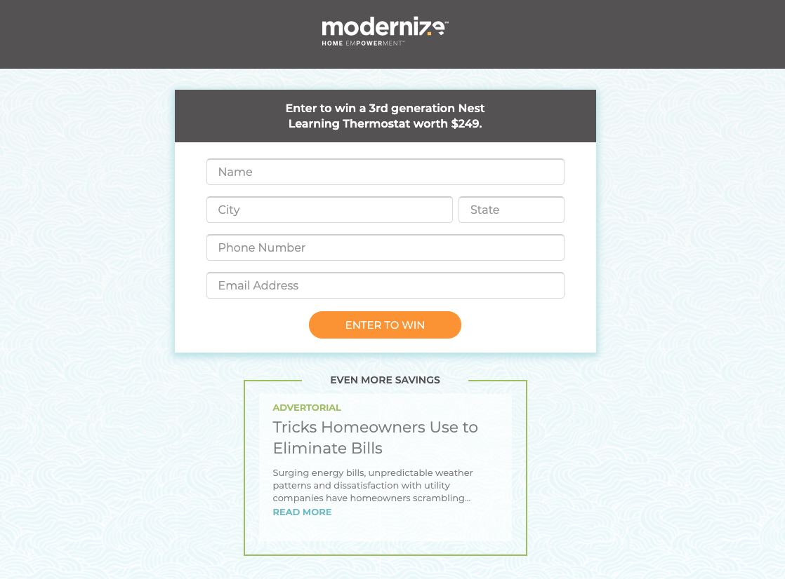
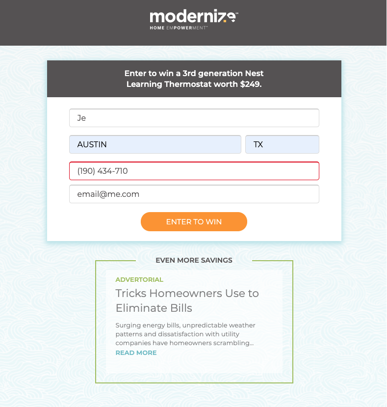
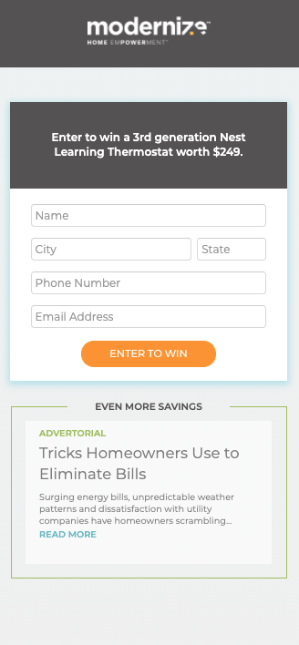
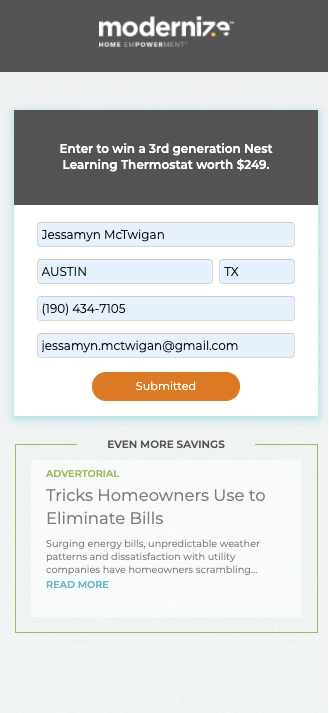

# Modernize-Enter-To-Win-Challenge
#### advertorial made with js css and html

## Table of Contents

**[Quick Links](#Quick-Links)** 
**[First Looks](#First-Looks)** 
**[Bugs and Known Issues](#Bugs-and-Known-Issues)** 
**[Next Steps to Continue](#Next-Steps-to-Continue)** 
**[Acceptance Criteria](#Acceptance-Criteria)** 
**[Bonus](#Bonus)** 
**[Deliverables](#Deliverables)** 
**[License](#License)** 

## Quick Links

### click here to view --> [final Modernize - Take Home Challenge website](https://jessamyn27.github.io/Modernize-Enter-To-Win-Challenge/)

### click here to view --> [Walk Thru Video](https://drive.google.com/file/d/1-RfFzPpIHkNmVnkdTuEEu12hDgwqQs4K/view?usp=sharing)

## First Looks

# 
# 
# 
# 
# 

## Bugs and Known Issues

- retina support: learned all about it this week and would love to try that out in the future, making sure the images are crystal clear for supported devices and also compressed
- POST call timedout - tried running it through insomnia and testing as different calls, didn't get errors only timeout in network, would love to hear how I could improve that!
- background image from Sketch - I'm not sure if I downloaded it correctly, still looks a little off, will have to learn more about grabbing high quality images from Sketch to use for a website
- background animated gradient - not positive if the style was how it's described but, it does actually animate on top of the background! :)

## Next Steps to Continue

- more validation UI clean up and functionality (didn't address email with regex match) and hover / focus could be easier to see what's happening for user input
- accessibilty more standardized and expanded on
- More accessiblity like hover text info
- More browser compatibility css and @media queries to clean up some responsive scaling
- Add more accessibility (label over form control / page lang identity)
- Hover, Focus and other accessibilty standards need some tweaking
- test and clean up run time efficiency based on Google Analytics (organize acct structure / includes and excludes checklist ect..)
- Code Clean up CSS: set up global variables in SCSS for reusables (fonts, colors, headings and other elements ect...)
- Create more BEM reusable classes and class combos in CSS as well as changing some classes to id's if only used once
- Set more standards for basic elements in CSS
- add Sass or Less structure that compiles to one CSS for code organization and better css nesting/functional variables 

## Acceptance Criteria

#### General requirements:
- pixel perfect (on given breakpoints)
- cross-browser support (desktop and mobile)
- responsive design according to provided mockups (you can use 767px as a mobile breakpoint)
- retina support
- any copy on the page can be changed (in the source file) and it should NOT break the page
- background color should transition from #ECF8FB to #EFEFEF continuously with 5 sec duration: it takes 5 sec to change the color from #ECF8FB to #EFEFEF, then 5 - sec from #EFEFEF to #ECF8FB, and so on
- the page should be optimized for max performance and fast loading
- "Read more" link in the bottom opens google.com in a new window

#### Form requirements:
- phone field should have a mask for US phone number: (XXX) XXX-XXXX
- the form should be optimized for mobile UX (do your best)
- add form validation:
- "Name" field requires 2 or more chars
- "City" and "State" are optional
- "Phone" field is required and should have validation by mask
- "Email" field is required
- if there's an error, the field should change the border color to #D50303
- the form should submit data to https://formsws-hilstaging-com-0adj9wt8gzyq.runscope.net/solar via ajax (ignore any errors)
- after successful submission, change the button copy to "Submitted" and do not allow any more submissions

#### Deliverables
- create a Github repository with your project that we can download and run
- the online demo is not required but would be great
- provide us with the time it took you to complete
- what took the most time, what was tricky?
- any final thoughts or comments are welcome

## Bonus

- 1. Transpile JS for compatibility with other browsers (Safari/iOS)
- 2. Use of the Airbnb style guide
- 3. Unit tests for critical functions
- 4. Use JSDocs 3 pattern for comments

## License

[MIT License](https://opensource.org/licenses/MIT)

**[Back Up To Top](#Modernize-Enter-To-Win-Challenge)**
